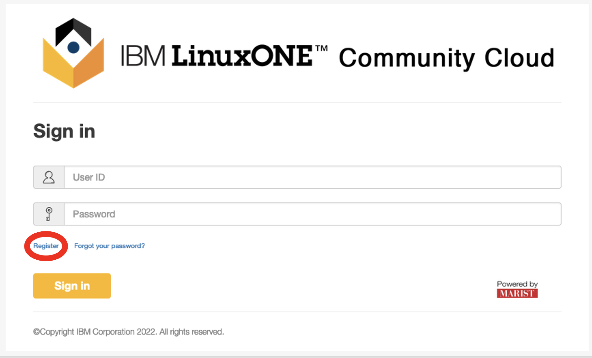

# Registering for IBM LinuxONE Community Cloud Account
## Follow these steps to sign up for a free account with the IBM LinuxONE Community Cloud and get access to a virtual server running on IBM LinuxONE.
If you are already registered, you can skip to [step 2](./2_provision.md) to provision your server.
1) Go to the [IBM LinuxONE Community Cloud website](https://linuxone.cloud.marist.edu/#/login) using Firefox or Google Chrome.
2) Click `Register`.

3) Fill out the following page using EventCode: `WSCZLINUX` \
If you are doing this training outside of an official class, the EventCode is not required. However, it may take a few more minutes for your request to be accepted. 
\
4) Once you've filled everything in, click on the `Request your trial` button. \
5) Look in your email for your activation link. You should have received an email from `noreply@linuxone.cloud.marist.edu` titled: "IBM LinuxONE Community Cloud Registration - Action required to complete". \
6) Click the `Activate your account or entitlement` link, which is valid for 48 hours. \
7) Click the `Sign in` button on the page it takes you to. \
## You are now ready for [step 2](./2_provision.md), where you will provision (setup) your virtual server.