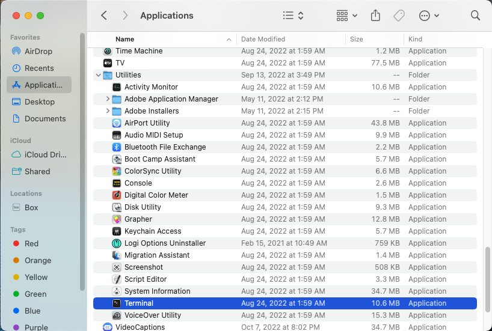

# Connecting to your Server - Mac
## Follow these steps to connect to your virtual server via Secure Shell (SSH) on Mac using the Terminal.
* If you haven't provisioned your virtual server yet, see [step 2](./2_provision.md) for instructions.
* If you're a Windows user, go [here](./3_windows_connect.md) instead.
1) Get the IP address of your virtual server [here](https://linuxone.cloud.marist.edu/#/instance) from IBM LinuxONE Community Cloud.
2) Open the 'Terminal' application. It can be found in 'Finder' under 'Applications/Utilities':



3) Stick with me here, this part's a little tricky. If you need help please ask me! In the terminal prompt, type in the following command, but substitute in the path to your private key file that you created when provisioning your virtual server:
```
chmod 400 <path-to-key-file>
```
For example:
```
chmod 400 ~/Downloads/test1234.pem
```
4) Type in the following command, but substitute in your server's IP address and the path to your private key file:
```
ssh linux1@<ip-address> -i <path-to-key-file>
```
For example:
```
ssh linux1@148.100.77.96 -i ~/Downloads/test1234.pem
```
5) After doing so you will see the following message:
```
The authenticity of host '148.100.77.96 (148.100.77.96)' can't be established.
ED25519 key fingerprint is SHA256:FwHNWt0fu76CthKGSQfBTt4QvfrpoEgW+MMG0jPCQ7g.
This host key is known by the following other names/addresses:
    ~/.ssh/known_hosts:170: 148.100.77.184
Are you sure you want to continue connecting (yes/no/[fingerprint])?
```
Type in `yes` and hit the Enter key.

You should see the following text appear:
```
 ___ ____  __  __      _     _                   ___  _   _ _____
|_ _| __ )|  \/  |    | |   (_)_ __  _   ___  __/ _ \| \ | | ____|
 | ||  _ \| |\/| |    | |   | | '_ \| | | \ \/ / | | |  \| |  _|
 | || |_) | |  | |    | |___| | | | | |_| |>  <| |_| | |\  | |___
|___|____/|_|  |_|    |_____|_|_| |_|\__,_/_/\_\\___/|_| \_|_____|

=================================================================================
Welcome to the IBM LinuxONE Community Cloud!

This server is for authorized users only. All activity is logged and monitored.
Individuals using this server must abide to the Terms and Conditions listed here:
https://www.ibm.com/community/z/ibm-linuxone-community-cloud-terms-and-conditions/
Your access will be revoked for any non-compliance.
==================================================================================
Last login: Sat Feb 11 17:09:01 2023 from 76.172.75.216
[linux1@test1234 ~]$
```

## You are now connected and ready to continue on to [step 4](./4_run_playbooks.md).
