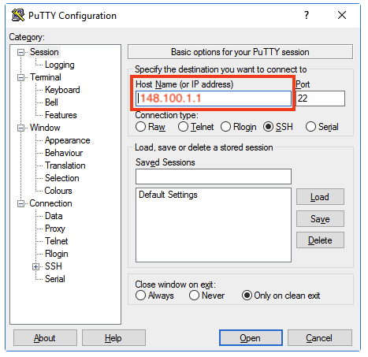
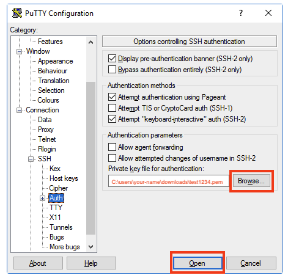
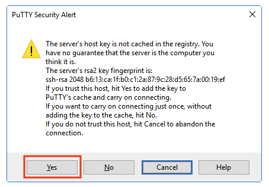

# Connecting to your Server - Windows
## Follow these steps to connect to your virtual server via Secure Shell (SSH) on Windows using PuTTY.
* If you haven't provisioned your virtual server yet, see [step 2](./2_provision.md) for instructions.
* If you're a Mac user, go [here](./3_mac_connect.md) instead.
1) Get your IP address for your virtual server [here](https://linuxone.cloud.marist.edu/#/instance) from IBM LinuxONE Community Cloud.
2) Open the 'PuTTY' application by selecting it from your 'Programs' menu. If you have Windows 10, you can do this most easily by clicking the Windows icon in the lower-left hand corner and then typing 'putty'.
3) Enter that IP address in the Host Name (or IP address) box:



4) Click on `SSH` and then `Auth` in the 'Category' sidebar:
5) Find and select the SSH private key file that you created when provisioning your virtual server (i.e. C:\users\your-name\downloads\test1234.pem).
6) Click `Open` to establish a connection to the server.



7) You may see a 'PuTTY Security Alert' warning you that 'the server's host key is not cached in the registry'. This is normal for first-time connections. Click 'Yes' to continue:



You should see the following text appear:
```
 ___ ____  __  __      _     _                   ___  _   _ _____
|_ _| __ )|  \/  |    | |   (_)_ __  _   ___  __/ _ \| \ | | ____|
 | ||  _ \| |\/| |    | |   | | '_ \| | | \ \/ / | | |  \| |  _|
 | || |_) | |  | |    | |___| | | | | |_| |>  <| |_| | |\  | |___
|___|____/|_|  |_|    |_____|_|_| |_|\__,_/_/\_\\___/|_| \_|_____|

=================================================================================
Welcome to the IBM LinuxONE Community Cloud!

This server is for authorized users only. All activity is logged and monitored.
Individuals using this server must abide to the Terms and Conditions listed here:
https://www.ibm.com/community/z/ibm-linuxone-community-cloud-terms-and-conditions/
Your access will be revoked for any non-compliance.
==================================================================================
Last login: Sat Feb 11 17:09:01 2023 from 76.172.75.216
[linux1@test1234 ~]$
```

## You are now connected and ready to continue on to [step 4](./4_navigate.md).